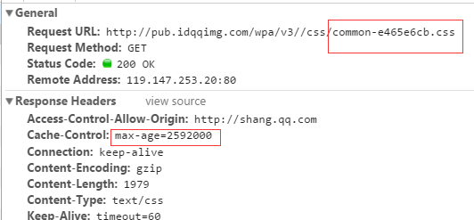
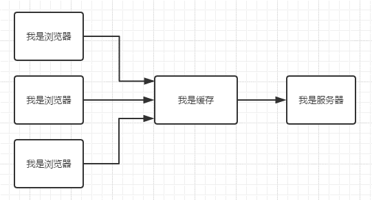
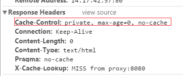
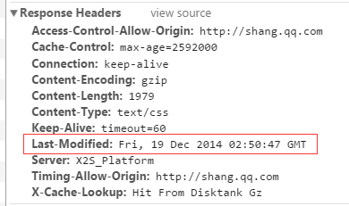

# 浏览器缓存

以前总是傻傻的分不清缓存和`cookie`,误认为cookie就是指浏览器缓存.还有 `cookie` `localStorage`` sessionStorage` 缓存 四者的关系也没有搞明白.经过一番折腾,终于从网上找到了一些关于缓存的知识.今天这篇文章就先介绍一下缓存吧.

在前端开发中,性能一直都是被大家所重视的一点,然而判断一个网站的性能最直观的就是看网页打开的速度.其中提高网页反应速度的一个方式就是使用缓存.一个优秀的缓存策略可以缩短网页请求资源的距离,减少延迟,并且由于缓存文件可以重复利用,还可以减少带宽,降低网络负荷.那么下面我们就来看看服务器端缓存的原理.

## 缓存分类
web缓存分为很多种,比如数据库缓存、代理服务器缓存、还有我们熟悉的`CDN`缓存,以及浏览器缓存.对于太多文字的阅读其实我是拒绝的,于是就画了个图来解释下.
浏览器通过代理服务器向源服务器发起请求的原理如下图
web缓存分为很多种,比如数据库缓存、代理服务器缓存、还有我们熟悉的`CDN`缓存,以及浏览器缓存.对于太多文字的阅读其实我是拒绝的,于是就画了个图来解释下.
浏览器通过代理服务器向源服务器发起请求的原理如下图:


浏览器先向代理服务器发起`Web`请求,再将请求转发到源服务器.它属于共享缓存,所以很多地方都可以使用其缓存资源,因此对于节省流量有很大作用.

浏览器缓存是将文件保存在客户端,在同一个会话过程中会检查缓存的副本是否足够新,在后退网页时,访问过的资源可以从浏览器缓存中拿出使用.通过减少服务器处理请求的数量,用户将获得更快的体验
下面我就来着重讲下传说中的浏览器缓存.
## 浏览器缓存
页面的缓存状态是由header决定的,header的参数有四种：

### 一、 Cache-Control（重要策略）：
`Cache-Control`包括：max-age / s-maxage/public/private/no-cache/no-store/must-revalidate等

1、`max-age`（单位为s）指定设置缓存最大的有效时间,定义的是时间长短.当浏览器向服务器发送请求后,在max-age这段时间里浏览器就不会再向服务器发送请求了.
我们来找个资源看下.比如`shang.qq.com`上的css资源,`max-age=2592000`,也就是说缓存有效期为2592000秒（也就是30天）.于是在30天内都会使用这个版本的资源,即使服务器上的资源发生了变化,浏览器也不会得到通知.max-age会覆盖掉Expires,后面会有讨论.



2、`s-maxage`（单位为s）同max-age,只用于共享缓存（比如`CDN`缓存）.
比如,当`s-maxage=60`时,在这60秒中,即使更新了`CDN`的内容,浏览器也不会进行请求.也就是说`max-age`用于普通缓存,而`s-maxage`用于代理缓存.如果存在s-maxage,则会覆盖掉`max-age`和`Expires header`.
3、`public` 指定响应会被缓存,并且在多用户间共享.也就是下图的意思.如果没有指定`public`还是`private`,则默认为`public`.



4、`private` 响应只作为私有的缓存（见下图）,不能在用户间共享.如果要求`HTTP`认证,响应会自动设置为`private`.


5、`no-cache` 指定不缓存响应,表明资源不进行缓存



但是设置了`no-cache`之后并不代表浏览器不缓存,而是在缓存前要向服务器确认资源是否被更改.因此有的时候只设置`no-cache`防止缓存还是不够保险,还可以加上`private`指令,将过期时间设为过去的时间.
6、`no-store` 绝对禁止缓存,一看就知道如果用了这个命令当然就是不会进行缓存啦～每次请求资源都要从服务器重新获取.
7、`must-revalidate`指定如果页面是过期的,则去服务器进行获取.这个指令并不常用,就不做过多的讨论了.
### 二、Expires
缓存过期时间,用来指定资源到期的时间,是服务器端的具体的时间点.也就是说,`Expires=max-age + `请求时间,需要和`Last-modified`结合使用.但在上面我们提到过,`cache-control`的优先级更高. `Expires`是`Web`服务器响应消息头字段,在响应`http`请求时告诉浏览器在过期时间前浏览器可以直接从浏览器缓存取数据,而无需再次请求.'


### 三、Last-modified
服务器端文件的最后修改时间,需要和`cache-control`共同使用,是检查服务器端资源是否更新的一种方式.当浏览器再次进行请求时,会向服务器传送`If-Modified-Since`报头,询问Last-Modified时间点之后资源是否被修改过.如果没有修改,则返回码为304,使用缓存；如果修改过,则再次去服务器请求资源,返回码和首次请求相同为200,资源为服务器最新资源.
如下图,最后修改时间为2014年12月19日星期五2点50分47秒



### 四、ETag
根据实体内容生成一段`hash`字符串,标识资源的状态,由服务端产生.浏览器会将这串字符串传回服务器,验证资源是否已经修改,如果没有修改,过程如下：


使用ETag可以解决`Last-modified`存在的一些问题：
```
a、某些服务器不能精确得到资源的最后修改时间,这样就无法通过最后修改时间判断资源是否更新 
b、如果资源修改非常频繁,在秒以下的时间内进行修改,而`Last-modified`只能精确到秒 
c、一些资源的最后修改时间改变了,但是内容没改变,使用`ETag`就认为资源还是没有修改的.
```
### 使用缓存流程


`Etag/If-None-Match`
`Etag/If-None-Match`也要配合`Cache-Control`使用.
`lEtag：web`服务器响应请求时,告诉浏览器当前资源在服务器的唯一标识（生成规则由服务器觉得）`.Apache`中,`ETag`的值,默认是对文件的索引节（`INode`）,大小（`Size`）和最后修改时间（`MTime`）进行Hash后得到的.
`lIf-None-Match`：当资源过期时（使用`Cache-Control`标识的`max-age`）,发现资源具有`Etage`声明,则再次向`web`服务器请求时带上头`If-None-Match`（`Etag`的值）`.web`服务器收到请求后发现有头`If-None-Match`则与被请求资源的相应校验串进行比对,决定返回200或304.

Last-Modified/If-Modified-Since
`Last-Modified/If-Modified-Since`要配合`Cache-Control`使用.
`lLast-Modified`：标示这个响应资源的最后修改时间.web服务器在响应请求时,告诉浏览器资源的最后修改时间.
`lIf-Modified-Since`：当资源过期时（使用`Cache-Control`标识的`max-age`）,发现资源具有`Last-Modified`声明,则再次向web服务器请求时带上头If-Modified-Since,表示请求时间.web服务器收到请求后发现有头`If-Modified-Since`则与被请求资源的最后修改时间进行比对.若最后修改时间较新,说明资源又被改动过,则响应整片资源内容（写在响应消息包体内）,`HTTP` 200；若最后修改时间较旧,说明资源无新修改,则响应`HTTP` 304 (无需包体,节省浏览),告知浏览器继续使用所保存的`cache`.

既生`Last-Modified`何生Etag？
你可能会觉得使用`Last-Modified`已经足以让浏览器知道本地的缓存副本是否足够新,为什么还需要`Etag`（实体标识）呢？`HTTP1.1`中`Etag`的出现主要是为了解决几个`Last-Modified`比较难解决的问题：
1.`Last-Modified`标注的最后修改只能精确到秒级,如果某些文件在1秒钟以内,被修改多次的话,它将不能准确标注文件的修改时间
2.如果某些文件会被定期生成,当有时内容并没有任何变化,但`Last-Modified`却改变了,导致文件没法使用缓存
3.有可能存在服务器没有准确获取文件修改时间,或者与代理服务器时间不一致等情形
`Etag`是服务器自动生成或者由开发者生成的对应资源在服务器端的唯一标识符,能够更加准确的控制缓存.`Last-Modified`与`ETag`是可以一起使用的,服务器会优先验证`ETag`,一致的情况下,才会继续比对`Last-Modified`,最后才决定是否返回304.

### cache-control指令使用
说了那么多`cache-control`的指令,那么如何选择使用哪些指令呢？


### 另外的缓存方式：LocalStorage和sessionStorage
除了开头提到的那么多缓存方式以外,还有一种我们都熟悉的缓存方式,`LocalStorage`和`sessionStorage`（好像是两种23333）.
`LocalStorage`是一种本地存储的公共资源,域名下很多应用共享这份资源会有风险；`LocalStorage`是以页面域名划分的,如果有多个等价域名之间的`LocalStorage`不互通,则会造成缓存多份浪费.
`LocalStorage`在`PC`上的兼容性不太好,而且当网络速度快、协商缓存响应快时使用`localStorage`的速度比不上304.并且不能缓存`css`文件.而移动端由于网速慢,使用`localStorage`要快于304.
而相对`LocalStorage`来说,`SessionStorage`的数据只存储到特定的会话中,不属于持久化的存储,所以关闭浏览器会清除数据.和`localstorage`具有相同的方法.
在前端开发中缓存是必不可少的,那么使用怎样的缓存方式更高效、让我们项目的性能更优,还是需要我们仔细斟酌.

## 如何启用Web缓存
### 启用缓存
了解了Web缓存的基本原理和重要性,接下来的问题就是如何在项目里使用.
 对于使用`nginx`或者`apache`做为`Web`前端的系统,有相应的指令达成目的,资料很多,比如可以参考`NGINX`下配置`CACHE-CONTROL`头部.
 对于使用高版本`Tomcat`的项目,没有必要自造轮子,官方实现的`ExpiresFilter`已经可以满足日常的使用,具体方法可以参考`ExpiresFilter`官方文档和`Tomcat`性能调优 通过`ExpiresFilter`设置资源缓存.
 对于使用低版本`Tomcat`的项目来说,虽然没有官方的过滤器可用,但可以自定义过滤器来实现缓存,具体方法可以参考`tomcat`中`Cache-Control` 的配置和使用`Cache-Control`和`gzip`提升`tomcat`应用性能(整理),代码和配置都比较简单,很好理解.

### 注意点
启用`Web`缓存之后,浏览器的缓存行为与用户的操作方式有关系,验证缓存特性开启的时候不要被假象蒙蔽.
使用`Tomcat`做应用容器,修改应用的`Web.xml`,增加缓存过滤器的配置,指定`max-age`为2周,此时使用`Chrome`访问应用的页面：
- 在浏览器地址栏里输入`URL`,多次按回车,使用调试器可以观察到除了第一次访问页面,浏览器需要从`Web`服务器请求静态资源,一旦静态资源下载完毕,`Chrome`后续直接从本地缓存中加载资源,不再向`Web`服务器发起请求；
- 按`F5`刷新页面或者右键菜单重新加载页面,浏览器向Web服务器发起加载静态资源的请求,Web服务器返回状态码304,表示资源未变化.


 <Vssue title="interview-catch" />


