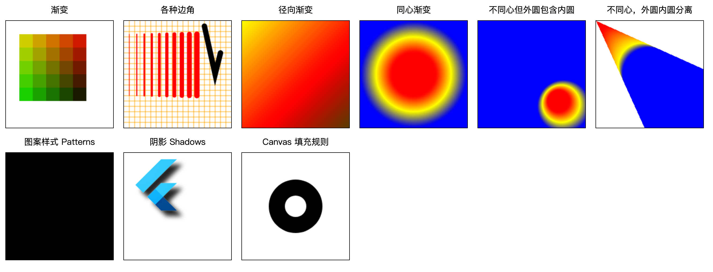

# Canvas

## 基础形状


:::tip
// 1

- 绘制一个填充的矩形
- fillRect( x ,y ,width, height)
- x:起点 x 轴坐标
- y:起点 y 轴坐标
- width:矩形长
- height:矩形宽
:::

```js
var canvas1 = document.getElementById("canvas1");
var ctx1 = canvas1.getContext("2d");

ctx1.fillRect(10, 10, 100, 30);
```

:::tip
// 2

- 绘制一个矩形的边框
- strokeRect( x ,y ,width, height)
- x:起点 x 轴坐标
- y:起点 y 轴坐标
- width:矩形长
- height:矩形宽
:::

```js
var canvas2 = document.getElementById("canvas2");
var ctx2 = canvas2.getContext("2d");
drawGrid("#ccc", 10, 10, ctx2);
ctx2.strokeRect(20, 20, 90, 100);
```

:::tip
// 3

- 清除指定矩形区域，让清除部分完全透明
- clearRect( x ,y ,width, height)
- 前提需要 fillReact 和背景色
:::

```js
var canvas3 = document.getElementById("canvas3");
var ctx3 = canvas3.getContext("2d");

ctx3.fillStyle = "red";
ctx3.fillRect(0, 0, 300, 150);
ctx3.clearRect(10, 10, 100, 50);
```

:::tip
// 4.绘制图形步骤

- (1)需要创建路径起始点。
- (2)使用画图命令去画出路径。
- (3)把路径封闭。
- (4)一旦路径生成，就能通过描边或填充路径区域来渲染图形
  >
- beginPath():新建一条路径，生成之后，图形绘制命令被指向到路径上生成路径
- closePath():闭合路径之后图形绘制命令又重新指向到上下文中
- stroke():通过线条来绘制图形轮廓
- fill():通过填充路径的内容区域生成实心的图形
:::

```js
var ctx4 = document.getElementById("canvas4").getContext("2d");
drawGrid("orange", 10, 10, ctx4);
ctx4.beginPath();
ctx4.moveTo(10, 10);
ctx4.lineTo(10, 50);
ctx4.lineTo(70, 100);
ctx4.stroke();
ctx4.closePath();

var ctx5 = document.getElementById("canvas5").getContext("2d");
drawGrid("orange", 10, 10, ctx5);
ctx5.beginPath();
ctx5.moveTo(10, 10);
ctx5.lineTo(10, 90);
ctx5.lineTo(70, 90);
ctx5.fill();
ctx5.closePath();
```

:::tip
// 5.绘制弧形

- arc(x, y, radius, startAngle, endAngle, anticlockwise)
- x,y:圆心坐标
- radius:半径
- startAngle,endAngle:开始结束弧度
- anticlockwise:Boolean 值,true 逆时针方向,false 顺时针方向
- 角度与弧度的 js 表达式:radians=(Math.PI/180)\*degrees
  :::

```js
var ctx6 = document.getElementById("canvas6").getContext("2d");
drawGrid("orange", 10, 10, ctx6);
ctx6.beginPath();
ctx6.arc(100, 100, 50, 0, Math.PI * 2, true);
ctx6.fill();
ctx6.stroke();
```

:::tip
// 6.贝塞尔（bezier）以及二次贝塞尔

- quadraticCurveTo(cp1x, cp1y, x, y):绘制二次贝塞尔曲线，x,y 为结束点，cp1x,cp1y 为控制点
- bezierCurveTo(cp1x, cp1y, cp2x, cp2y, x, y):绘制三次贝塞尔曲线，x,y 为结束点，cp1x,cp1y 为控制点一，cp2x,cp2y 为控制点二
  :::

## 颜色样式


:::tip
// 1.色彩样式
- fillStyle = color:设置图形的填充颜色
- strokeStyle = color:设置图形轮廓的颜色
:::

```js
var ctx1 = document.getElementById("canvas1").getContext("2d");
for (var i = 1; i < 6; i++) {
  for (var j = 1; j < 6; j++) {
    ctx1.fillStyle =
      "rgb(" +
      Math.floor(255 - 42.5 * i) +
      "," +
      Math.floor(255 - 42.5 * j) +
      ",0)";
    ctx1.fillRect(j * 25, i * 25, 25, 25);
  }
}
```

:::tip
// 2.线型样式
// lineWidth = value:设置线条宽度
- lineCap:设置线条末端样式
- 参数:
- butt 线段末端以方形结束。
- round 线段末端以圆形结束。
- square 线段末端以方形结束，但是增加了一个宽度和线段相同，高度是线段厚度一半的矩形区域
:::

```js
var ctx2 = document.getElementById("canvas2").getContext("2d");
drawGrid("orange", 10, 10, ctx2);

ctx2.strokeStyle = "red";
for (var i = 0; i < 10; i++) {
  ctx2.lineWidth = 1 + i;
  ctx2.beginPath();
  ctx2.lineCap = "round";
  ctx2.moveTo(10 + i * 14, 25);
  ctx2.lineTo(10 + i * 14, 140);
  ctx2.stroke();
}
```

:::tip
- lineJoin = type:设定线条与线条间接合处的样式
- round
- bevel
- miter(默认)
- miterLimit = value:限制当两条线相交时交接处最大长度；所谓交接处长度（斜接长度）是指线条交接处内角顶点到外角顶点的长度
>
- getLineDash():设置当前虚线样式
- setLineDash(segments):设置当前虚线样式
- lineDashOffset():设置虚线样式的起始偏移量
:::

```js
ctx2.beginPath();
ctx2.moveTo(150, 10);
ctx2.lineTo(170, 100);
ctx2.lineTo(180, 60);
ctx2.lineJoin = "miter";
ctx2.lineWidth = 10;
ctx2.miterLimit = 10;
ctx2.strokeStyle = "black";
ctx2.stroke();
```

:::tip
// 3.渐变 Gradients

- createLinearGradient(x1, y1, x2, y2):线性渐变
- 参数:
- 渐变的起点 (x1,y1) 与终点 (x2,y2)
- createRadialGradient(x1, y1, r1, x2, y2, r2):径向渐变
- 参数:
- 前三个定义一个以 (x1,y1) 为原点，半径为 r1 的圆，后三个参数则定义另一个以 (x2,y2) 为原点，半径为 r2 的圆
- gradient.addColorStop(position, color)
:::

> //径向

```js
var ctx3 = document.getElementById("canvas3").getContext("2d");
var linearGradient = ctx3.createLinearGradient(0, 0, 250, 250);
linearGradient.addColorStop(0, "yellow");
linearGradient.addColorStop(0.5, "red");
linearGradient.addColorStop(1, "green");
ctx3.fillStyle = linearGradient;
ctx3.fillRect(0, 0, 200, 200);
```

> // 同心

```js
var ctx4 = document.getElementById("canvas4").getContext("2d");
var rr = ctx4.createRadialGradient(100, 100, 40, 100, 100, 100);
rr.addColorStop(0, "red");
rr.addColorStop(0.5, "yellow");
rr.addColorStop(1, "blue");
ctx4.fillStyle = rr;
ctx4.fillRect(0, 0, 200, 200);
ctx4.fill();
```

> // 不同心但是外圆包含内圆

```js
var ctx5 = document.getElementById("canvas5").getContext("2d");
var rr2 = ctx5.createRadialGradient(150, 150, 20, 160, 160, 50);
rr2.addColorStop(0, "red");
rr2.addColorStop(0.5, "yellow");
rr2.addColorStop(1, "blue");
ctx5.fillStyle = rr2;
ctx5.fillRect(0, 0, 200, 200);
ctx5.fill();
```

> //不同心，外圆内圆分离

```js
var ctx6 = document.getElementById("canvas6").getContext("2d");
var rr3 = ctx6.createRadialGradient(20, 20, 10, 100, 100, 50);
rr3.addColorStop(0, "red");
rr3.addColorStop(0.8, "yellow");
rr3.addColorStop(1, "blue");
ctx6.fillStyle = rr3;
ctx6.fillRect(0, 0, 200, 200);
```

:::tip
// 4.图案样式 Patterns
- createPattern(image, type)
- Type:repeat，repeat-x，repeat-y 和 no-repeat
:::

```js
var ctx7 = document.getElementById("canvas7").getContext("2d");
var img = new Image();
img.src =
  "https://7n.w3cschool.cn/attachments/image/20170619/mayuan_canvas_radial1.jpg";
img.onload = function() {
  var ptn = ctx7.createPattern(img, "repeat");
  ctx7.fillStyle = ptn;
  ctx7.fillRect(0, 0, 200, 200);
};
```

:::tip
// 5.阴影 Shadows - fill: 两个可能的值： "nonzero": 默认值. "evenodd":
:::

```js
var ctx8 = document.getElementById("canvas8").getContext("2d");
var img = new Image();
img.src =
  "https://cdn.jsdelivr.net/gh/flutterchina/website@1.0/images/flutter-mark-square-100.png";
img.onload = function() {
  ctx8.shadowOffsetX = 10;
  ctx8.shadowOffsetY = 10;
  ctx8.shadowBlur = 8;
  ctx8.shadowColor = "#333";
  ctx8.drawImage(img, 10, 10);
};
// Canvas 填充规则
var ctx9 = document.getElementById("canvas9").getContext("2d");
ctx9.beginPath();
ctx9.arc(100, 100, 50, 0, Math.PI * 2, true);
ctx9.arc(100, 100, 20, 0, Math.PI * 2, true);
ctx9.fill("evenodd");
```

 <Vssue title="canvas" />
