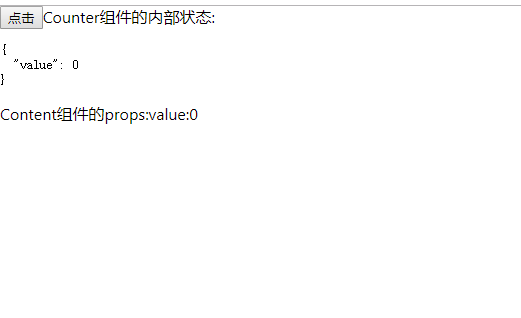
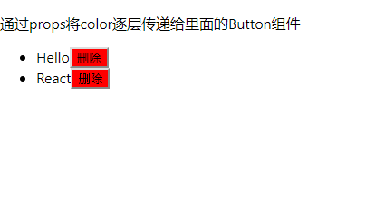
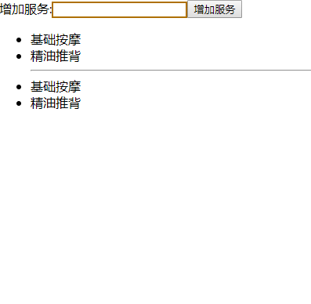

# props

::: tip
props 是 React 中很重要的一个概念,使用 props 向 React 组件传递数据,React 组件从 props 中取出数据,然后返回视图
:::

## 验证 props

数据类型验证

- 1.JavaScript 基本数据类型,包括数组,布尔,函数,数字,对象,字符串

```js
React.PropType.array;

React.PropType.bool;

React.PropType.func;

React.PropType.number;

React.PropType.object;

React.PropType.string;
```

- 2.可以被渲染为子节点的对象,包括数组,字符串,ReactElement(指 jsx 闭合标签)或数组

```js
React.PropType.node;
```

- 3.ReactElement

```js
React.PropType.element;
```

- 4.指定类的实例

```js
React.PropType.instanceOf(Message);
```

- 5.只接受指定的值

```js
React.PropType.oneOf(["News","Photos])
```

- 6.多个对象类型中的一个

```js
React.PropType.oneOfType([
  React.PropType.string,
  React.PropType.number,
  React.PropType.instanceOf(Message)
]);
```

- 7.指定类型组成的数组

```js
React.PropType.arrayOf(React.PropType.number);
```

- 8.指定类型的属性构成的对象

```js
React.PropType.objectOf(React.PropType.number);
```

- 9.符合指定格式的对象

```js
React.PropType.shape(
    color:React.PropType.string,
    fontSize:React.PropType.number
)
```

- 10.任意类型加上 isRequire 使其不可为空

```js
React.PropType.func.isRequired;
```

- 11.自定义验证器,如果验证失败了需要返回一个 Error 对象.不要直接使用 conosle.error 或抛异常,因为这样的话 oneOfType 会失效

```js
function(props,propName,componentName){
    if(!/matchme/.test(props[propName])){
        return new Error("Validation failed!")
    }
}
```

## 组合使用 props 和 state

使用 Counter 组件更新 state 的 value,然后将更新的 state.value 通过 props 传递给 Content 组件


```js
import React, { Component } from "react";
import PropTypes from "prop-types";

function Content(props) {
  return <p>Content组件的props:value:{props.value}</p>;
}
Content.propTypes = {
  value: PropTypes.number.isRequired
};

export default class Counter extends Component {
  constructor() {
    super();
    this.state = { value: 0 };
  }
  render() {
    return (
      <div>
        <button
          onClick={() =>
            this.setState({
              value: this.state.value + 1
            })
          }
        >
          点击
        </button>
        Counter组件的内部状态:
        <pre>{JSON.stringify(this.state, null, 2)}</pre>
        <Content value={this.state.value} />
      </div>
    );
  }
}
```

## props 传递数据

MessageList=>Message=>Button


```js
import React from "react";
import PropTypes from "prop-types";
// 按钮
function Button(props) {
  return <button style={{ background: props.color }}>{props.children}</button>;
}
Button.propType = {
  color: PropTypes.string.isRequired,
  children: PropTypes.string.isRequired
};

// 消息
function Message(props) {
  return (
    <li>
      {props.text}
      <Button color={props.color}>删除</Button>
    </li>
  );
}
Message.propType = {
  text: PropTypes.string.isRequired,
  color: PropTypes.string.isRequired
};
// 列表
function MessageList() {
  const color = "red";
  const messages = [{ text: "Hello" }, { text: "React" }];
  const children = messages.map((message, key) => (
    <Message key={key} text={message.text} color={color} />
  ));
  return (
    <div>
      <p>通过props将color逐层传递给里面的Button组件</p>
      <ul>{children}</ul>
    </div>
  );
}
export default MessageList;
```

通过 getChildContext()方法将 color 放在 context 中,并声明了 childContxtTypes,如果不声明 chilContextTypes,将无法在组件中使用 getChildContext()方法

:::tip

1.state 内部状态或者局部状态

2.Props 与 context 则用于组件之间传递数据,使用 props 传递数据简单清晰,但是跨级传递非常麻烦,使用 context 可以跨级传递数据,但是降低组件的复用性,因为这些组件依赖上下文,所以近况使用 context 传递登陆的状态,颜色主题等全局数据
:::

## setState


```js
import React, { Component, Fragment } from "react";
import "./style.css";
import XiaojiejieItem from "./XiaojiejieItem";
export default class Xiaojiejie extends Component {
  constructor(props) {
    super(props);
    this.state = {
      inputVal: "",
      list: ["基础按摩", "精油推背"]
    };
  }

  render() {
    return (
      <Fragment>
        {/* jsx注释 */}
        {/* htmlFor和for冲突 */}
        <label htmlFor="add">增加服务:</label>
        <input
          id="add"
          value={this.state.inputVal}
          onChange={this.inputChange.bind(this)}
          className="input"
        />
        <button onClick={this.addList.bind(this)}>增加服务</button>
        <ul>
          {/* html解析
                dangerouslySetInnerHTML={{__html:item}} */}
          {this.state.list.map((item, index) => {
            return (
              <li
                key={index + item}
                onClick={this.deleteItem.bind(this, index)}
                dangerouslySetInnerHTML={{ __html: item }}
              >
                {/* {item} */}
              </li>
            );
          })}
          {this.state.list.map((item, index) => {
            return <XiaojiejieItem key={index} text={item} />;
          })}
        </ul>
      </Fragment>
    );
  }

  //输入框改变
  inputChange(e) {
    console.log(e.target.value);
    //this.state.inputVal=e.target.value
    this.setState({
      inputVal: e.target.value
    });
  }

  //新增列表
  addList() {
    this.setState({
      list: [...this.state.list, this.state.inputVal],
      inputVal: ""
    });
  }
  //删除列表项
  deleteItem(index) {
    console.log(index);
    let list = this.state.list;
    list.splice(index, 1);
    //错误写法,严禁操作state里面的值,影响性能
    //this.state.list.splice(index,1);
    this.setState({
      list: list
    });
  }
}
```
:::tip
setSate是一个异步方法
:::
```js
render(){
  return(
  <ul ref={(ul)=>{this.ul=ul}}>
  ....
  </ul>
  )
}
addList() {
      // setState异步方法
        this.setState({
            list: [...this.state.list, this.state.inputVal],
            inputVal:''
        })
        console.log(this.ul.querySelectorAll('li').length)
    }
 ```
这样打印的话长度始终少了一个,因为console.log已经执行了,setState才执行完,故长度少1
> 解决办法
```js
addList() {
      // setState异步方法
        this.setState({
            list: [...this.state.list, this.state.inputVal],
            inputVal:''
        },()=>{
        console.log('长度',this.ul.querySelectorAll('li').length)
        })
    }
```


## 父子组件传值

父组件

```js
{
  this.state.list.map((item, index) => {
    return (
      <XiaojiejieItem
        key={index + item}
        // 传值
        content={item}
        index={index}
        // 传递方法
        deleteItem={this.deleteItem.bind(this)}
      />
    );
  });
}
```

子组件


```js
import React, { Component } from "react";
class XiaojiejieItem extends Component {
  constructor(props) {
    super(props);
    this.handleClick = this.handleClick.bind(this);
  }
  render() {
    return <li onClick={this.handleClick}>{this.props.content}</li>;
  }
  //   子组件调用父组件方法
  handleClick() {
    console.log(this.props.index);
    this.props.deleteItem(this.props.index);
  }
}

export default XiaojiejieItem;
```

 <Vssue title="props" />
