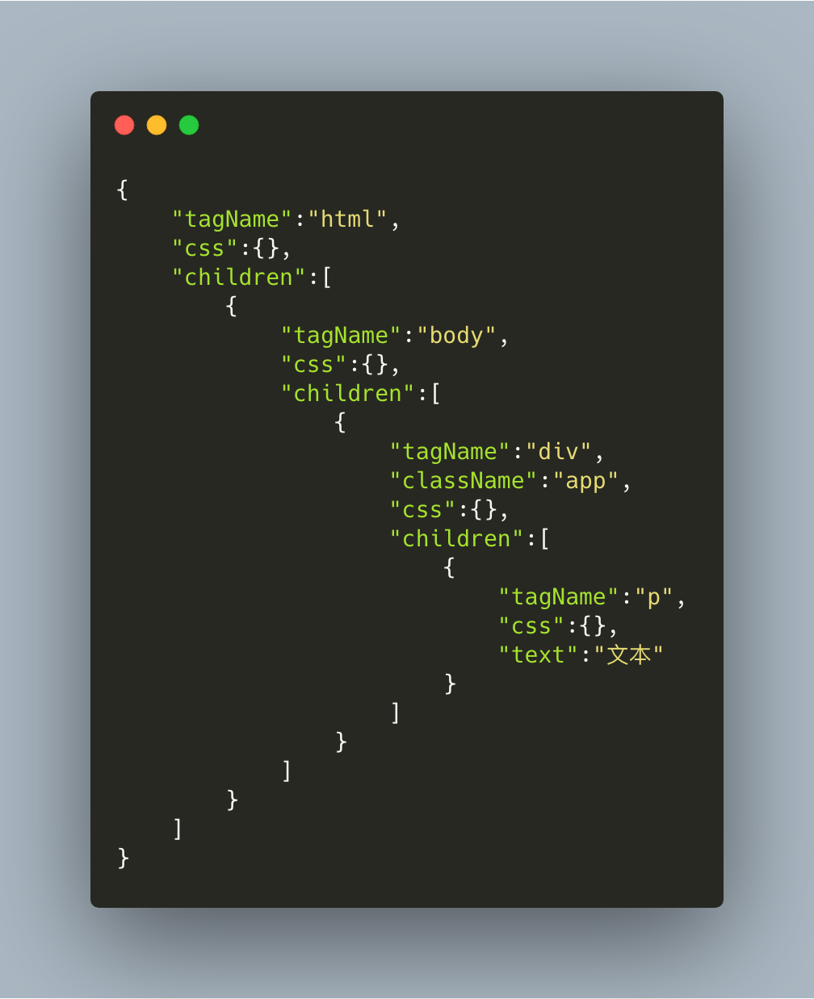

# 虚拟dom预备知识
## DocumentFragment
:::tip
DocumentFragment，文档片段接口，表示一个没有父级文件的最小文档对象。它被作为一个轻量版的 Document 使用，用于存储已排好版的或尚未打理好格式的XML片段。最大的区别是因为 DocumentFragment 不是真实DOM树的一部分，它的变化不会触发 DOM 树的（重新渲染) ，且不会导致性能等问题。

最常用的方法是使用文档片段作为参数（例如，任何 Node 接口类似 Node.appendChild 和 Node.insertBefore) 的方法），这种情况下被添加(append)或被插入(inserted)的是片段的所有子节点, 而非片段本身。因为所有的节点会被一次插入到文档中，而这个操作仅发生一个重渲染的操作，而不是每个节点分别被插入到文档中，因为后者会发生多次重渲染的操作。

该接口在Web组件中也非常有用: 模板 元素在其 HTMLTemplateElement.content 属性中包含了一个 DocumentFragment 。

可以使用document.createDocumentFragment 方法或者构造函数来创建一个空的 DocumentFragment.
:::

## VDOM
### 什么是虚拟DOM?
虚拟DOM的本质是一个和真实DOM结构类似的JS对象

### 为什么要用虚拟DOM?
虚拟DOM可以提高浏览器的渲染速度。对比操作JS对象，操作真实的DOM消耗的性能较多，频繁的操作DOM时，优势彰显的更为明显。

### 虚拟DOM的实现步骤?
1、在页面首次渲染时，将要渲染的数据全部加载到虚拟DOM中，而后在一次性渲染到真实DOM上

2、在数据变化时，额外的生成一颗虚拟DOM树

3、通过Diff算法对比修改的部分，而后将修改部分渲染到真实的DOM中

4、释放内存
## 真实DOM与虚拟DOM示意图
:::tip
真实dom
:::

:::tip
虚拟DOM
:::

## key值的作用
- 首先，在Vue中，存在一个DOM复用机制，会尽量的回收DOM元素进行复用，而这个机制本身是高效的，但很多时候也会造成不可预知的Bug，而在加了key值后，元素就有了一个标识，复用机制不会复用带key值的元素。而React也存在类似的机制。

- 反之，若使用相同的key值，可以使组件复用，也有可能导致渲染内容缺失。

- 因此，key值一般来说，最好是独一无二的。

- 除此之外，虚拟DOM在使用Diff算法进行对比时，若存在key值，可以更高效更迅速。

 <Vssue title="vue-dom" />
